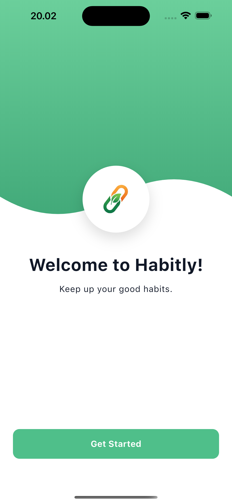
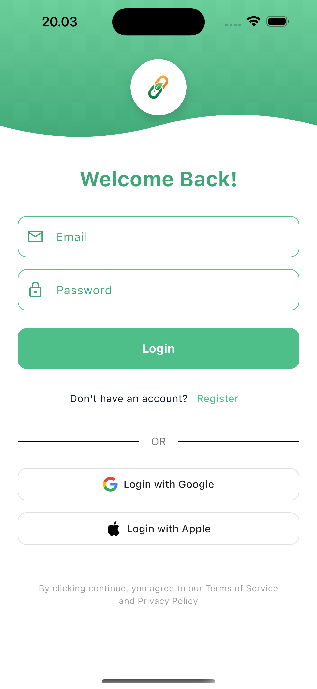
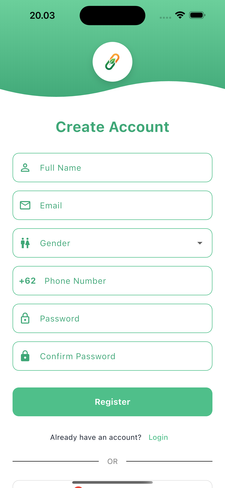
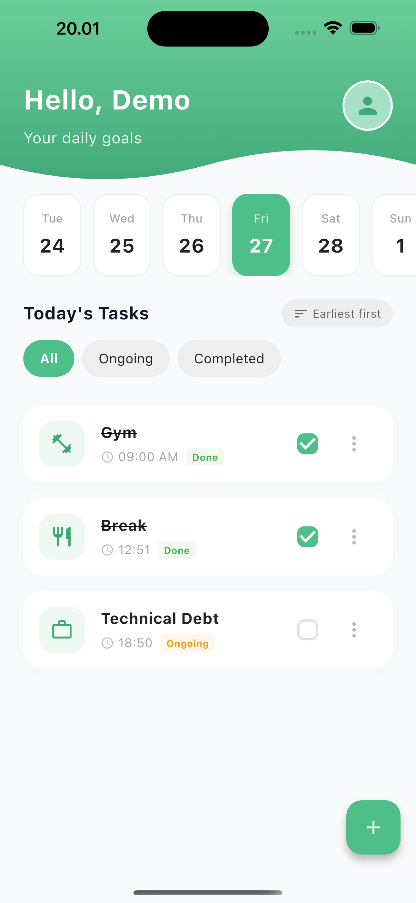

# Habitly - Build Better Habits 🚀

Habitly is a modern, elegant habit tracking application built with Flutter. It tracks your daily routines, helps you build consistency, and provides a beautiful, user-friendly interface to manage your goals.

## 📸 Screenshots

<p align="center">
  
  
  
  
</p>

## ✨ Features

- **Modern & Clean UI**
  - Enhanced Start, Login, and Register pages with beautiful wave designs.
- **Habit Management (CRUD)**
  - **Create**: Add new habits with custom titles, categories, and times.
  - **Read**: View your daily tasks filtered by date using the horizontal calendar.
  - **Update**: Edit existing habits easily via the card menu.
  - **Delete**: Remove habits you no longer need.

- **Smart Categorization**
  - Visual icons for categories (Work, Health, Learning, Shopping, etc.).
  - Ability to add **Custom Categories** dynamically.

- **Dark Mode Support 🌙**
  - Fully adaptable to system theme preferences.
  - Optimized color schemes for both Light and Dark modes.

- **Cloud Sync & Authentication ☁️**
  - Secure User Authentication powered by **Firebase Auth**.
  - Cloud data synchronization mapped with **Firebase Firestore**.

## 🛠 Tech Stack

- **Framework**: Flutter
- **Language**: Dart
- **Architecture**: Feature-based folder structure
- **State Management**: Riverpod (StateNotifier & Provider)
- **Local Database**: Hive (NoSQL)
- **Backend**: Firebase (Authentication & Firestore)
- **Assets**: Custom SVGs & Images

## 🏗 Architecture & State Management

### 📦 Hive (Local Database)

We use **Hive** for fast, lightweight, and secure local data storage.

- **Service**: `HiveService` (`lib/core/services/hive_service.dart`) handles all database operations.
- **Data Model**: `HabitModel` is adapted using `TypeAdapter` to store custom objects directly.
- **Box**: A dedicated box named `habits` stores all the user's habit data, persisting it across app restarts.

### 🦋 Riverpod (State Management)

**Riverpod** provides a robust and testable way to manage the app's state.

- **Provider**: `habitProvider` (StateNotifierProvider) manages the list of habits, loading states, and errors.
- **Logic**: `HabitNotifier` handles business logic (CRUD operations) and updates the UI reactively.
- **Filtering**: `filteredHabitsProvider` listens to `habitProvider` and `selectedDateProvider` to efficiently filter habits for the selected day without mutating the original list.

## 📥 Try It Out!

Want to experience **Habitly** instantly? You can download the compiled Android APK directly to your device without building from source:

- 📱 **[Download app-release.apk](./app-release.apk)**

## 🚀 Getting Started

### Prerequisites

- Flutter SDK (Latest Stable)
- Dart SDK

### Installation

1. **Clone the repository**

   ```bash
   git clone https://github.com/alzahfariski/habitly.git
   ```

2. **Navigate to project directory**

   ```bash
   cd habitly
   ```

3. **Install dependencies**

   ```bash
   flutter pub get
   ```

4. **Run the app**
   ```bash
   flutter run
   ```

## 📂 Project Structure

```
lib/
├── app/                 # App entry point and routing
├── core/                // Core configurations
│   ├── constants/       # App colors, routes, assets
│   ├── themes/          # App theme data (Light/Dark)
│   └── widgets/         # Reusable widgets (Buttons, Clippers)
├── features/            // Feature modules
│   ├── auth/            # Login & Register pages
│   ├── home/            # Home page, Models, Widgets
│   └── intro/           # Start/Onboarding page
└── main.dart            # Main function
```
